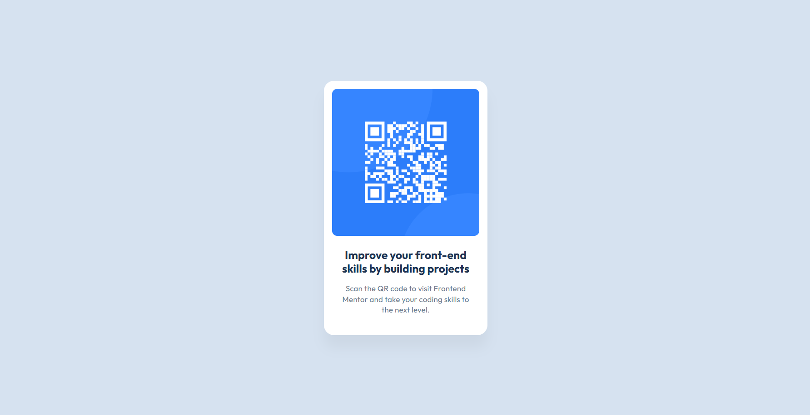

# Frontend Mentor - QR code component solution

This is a solution to the [QR code component challenge on Frontend Mentor](https://www.frontendmentor.io/challenges/qr-code-component-iux_sIO_H). Frontend Mentor challenges help you improve your coding skills by building realistic projects. 

## Table of contents

- [Overview](#overview)
  - [Screenshot](#screenshot)
  - [Links](#links)
- [My process](#my-process)
  - [Built with](#built-with)
  - [What I learned](#what-i-learned)
  - [Continued development](#continued-development)
  - [Useful resources](#useful-resources)
- [Author](#author)
- [Acknowledgments](#acknowledgments)

## Overview

### Screenshot



### Links

- Solution URL: [Add solution URL here](https://your-solution-url.com)
- Live Site URL: [Add live site URL here](https://your-live-site-url.com)

## My process

### Built with

- Semantic HTML5 markup
- Flexbox


### What I learned

I learned how to properly use `flexbox` for centering elements both vertically and horizontally.

```css
body {
  display: flex;
  align-items: center;
  justify-content: center;
  height: 100vh;
}
```

### Continued Development

Mention any areas where you'd like to improve or concepts you'd like to explore further. Example:

```markdown
I want to focus on:
- Using media queries to make designs even more responsive.
- Experimenting with CSS Grid for layout designs.
- Improving my CSS naming conventions (e.g., using BEM).

## Author

- Frontend Mentor - [@sirine-zanina](https://www.frontendmentor.io/profile/sirine-zanina)
- Twitter - [@supernova__star](https://x.com/supernova__star)


## Acknowledgments

I want to thank Frontend Mentor for providing this challenge, which helped me improve my CSS Flexbox skills.  
